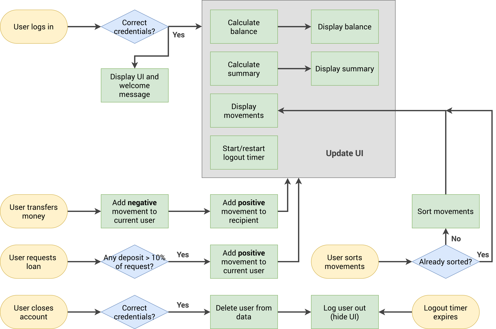
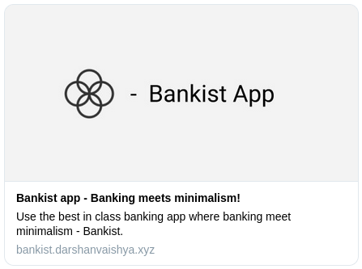
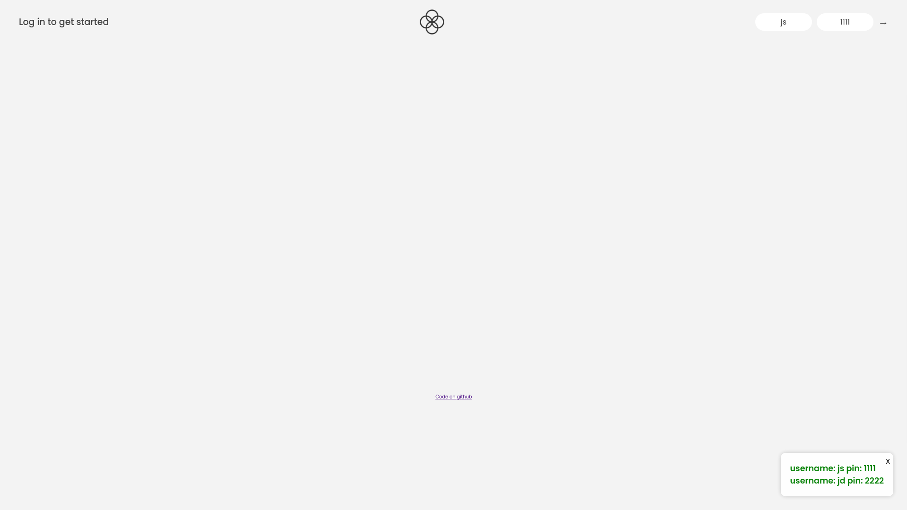
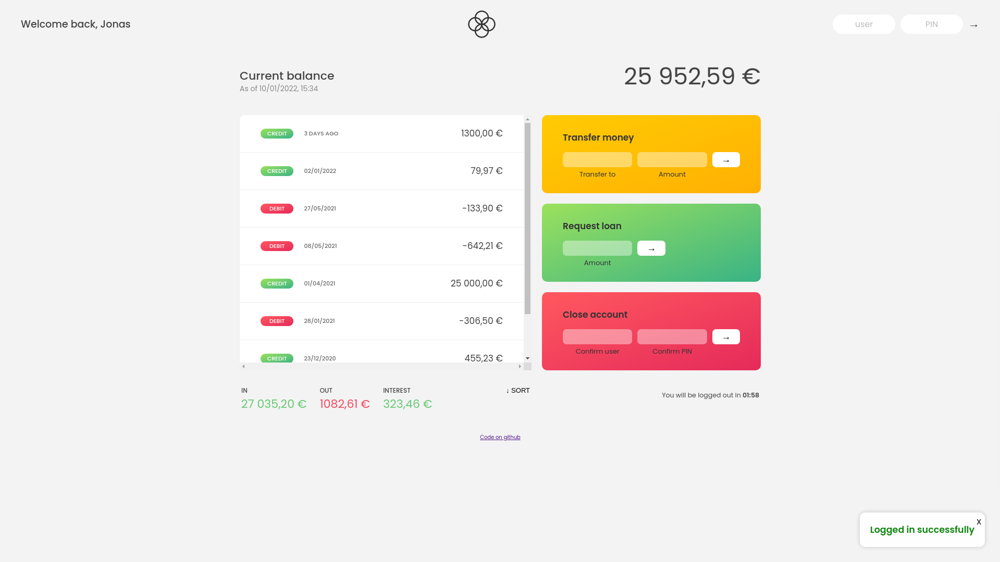
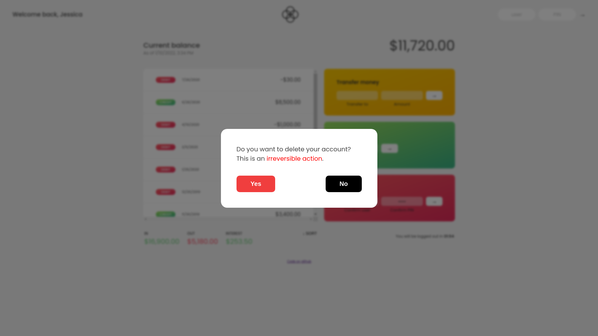
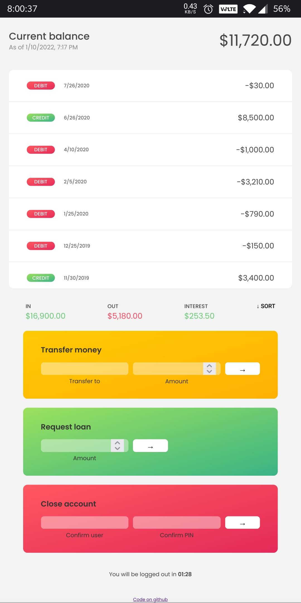

# Bankist app (10th Jan, 2022)

<details>
 <summary><strong>Table of Contents</strong> (click to expand)</summary>	

- [Overview](#overview)
  - [Login data](#login-data)
  - [Technologies used](#technologies-used)
- [Flowchart](#flowchart)
- [Challenges faced](#challenges-faced)
- [Learning outcomes](#learning-outcomes)
- [Screenshots](#screenshots)
- [Directory structure](#directory-structure)
- [Collaboration](#collaboration)
- [Contact me](#contact-me)
</details>

## Overview

Bankist app is a web app created using HTML, CSS and JS. It can perform actions such as requesting loan, transfering funds to users, deleting account, sorting transactions. It uses Internationalization API to internationalize numbers, date and time for greater user experience. It has a auto logout feature which triggers when a user has been inactive for 2 minutes. It also has a fully responsive desktop, tablet and mobile view.

Live Preview: [Link](https://bankist.darshanvaishya.xyz)

[](https://app.netlify.com/sites/suspicious-knuth-ed7f46/deploys)

### Login data

| username | pin  |
| -------- | ---- |
| js       | 1111 |
| jd       | 2222 |

### Technologies used

- HTML
- CSS
- JavaScript
- Internationalization API
- Open Graph Meta Tags

## Challenges faced

For this project, I for the first time implemented notifcations on my website. The CSS part interesting to setup as I wanted the notifications fixed on bottom right, and have a nice sliding animation. I implemented everything except the sliding in part from JavaScript, as removing `hidden` class didn't trigger the transition. Turns out a simple setTimeout fixed it!

```js
// Slide in the notificationb
setTimeout(() => notification.classList.remove("hidden"), 50);
```

I wanted to have different currency, number and time format based on user's locale. This was a first for me, so after google around I found out about Internationalization API. This made things very easy!

```js
// For currency
function currencyFormatter(movement) {
	return new Intl.NumberFormat(currentAccount.locale, {
		style: "currency",
		currency: currentAccount.currency,
	}).format(movement);
}

// For dates
const dateFull = new Intl.DateTimeFormat(currentAccount.locale, options).format(
	date
);

// For time
const time = new Intl.DateTimeFormat(currentAccount.locale, options).format(
	date
);
```

## Learning outcomes

In terms of HTML, I learnt how to use OpenGraph Meta tags to have beautiful cards in social media.

In terms of CSS, I learnt a lot about `transition` and `position` property.

In terms of JS, internationalization API was the biggest take aways from this project for me. It was really interesting to learn and work with it. I also learnt how to write function doc strings in JavaScript. This project really helped me solidify my concepts of DOM manipulation, Array methods such as `map`, `filter`, `reduce`, `forEach` etc.

## Flowchart



## Screenshots

### Open Graph card



### Main screen



### Europeon user



### American user


### Transfering funds


### Modal window



### Mobile view



## Directory structure

```
.
├── assets
│   ├── css
│   │   ├── queries.css
│   │   └── style.css
│   ├── img
│   │   ├── Bankist-flowchart.png
│   │   ├── icon.png
│   │   ├── logo.png
│   │   ├── og-image.png
│   │   └── screenshots
│   │       ├── main.png
│   │       ├── mobile.jpg
│   │       ├── modal.png
│   │       ├── og-tag.png
│   │       ├── transfer.png
│   │       ├── user1.png
│   │       └── user2.png
│   └── js
│       └── script.js
├── index.html
└── README.md

5 directories, 16 files
```

## Collaboration

If you have found a bug, suggesting an improvement or want to collaborate then please raise an [issue](https://github.com/DarshanVaishya/bankist-app/issues) or create an [pull request](https://github.com/DarshanVaishya/bankist-app/pulls).

## Contact me

- [Twitter](https://twitter.com/darshan_vaishya)
- [LinkedIn](https://www.linkedin.com/in/darshan-vaishya-ba99001a9/)
