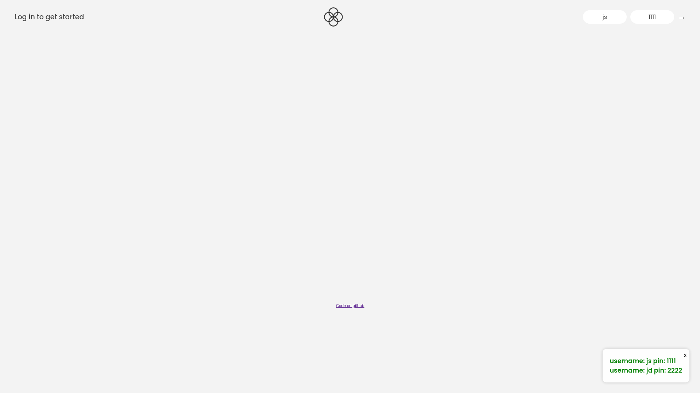
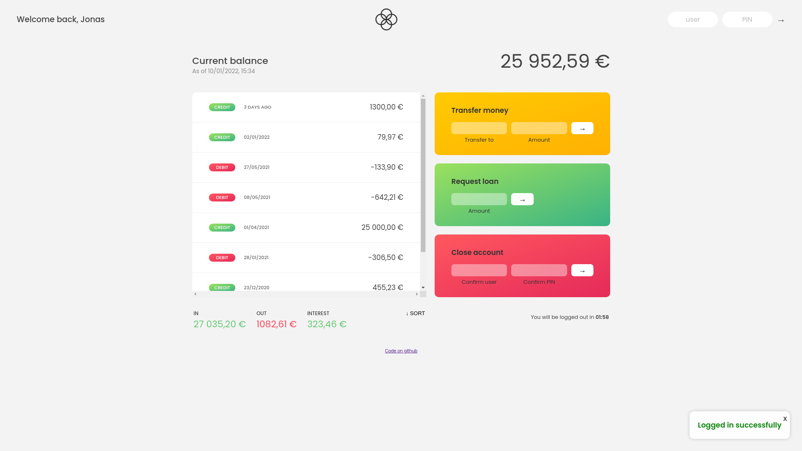
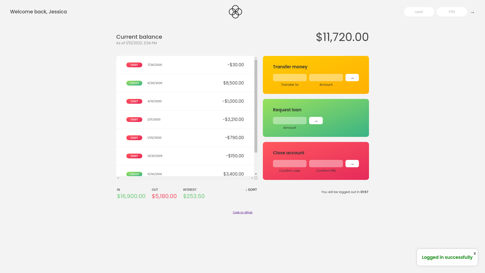
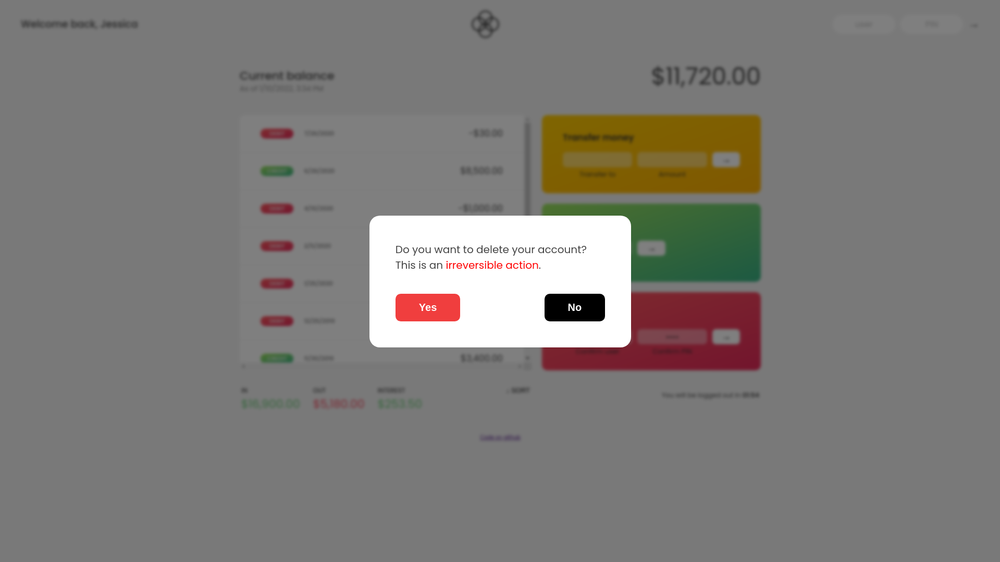

# Bankist app (10th Jan, 2022)

Bankist app is a web app created using HTML, CSS and JS. It can perform actions such as requesting loan, transfering funds to users, deleting account, sorting transactions. It uses Internationalization API to internationalize numbers, date and time for greater user experience. It has a auto logout feature which triggers when a user has been inactive for 2 minutes. It also has a fully responsive desktop, tablet and mobile view.

Live Preview: [Link](https://bankist.darshanvaishya.xyz)

## Test data for login

| username | pin  |
| -------- | ---- |
| js       | 1111 |
| jd       | 2222 |

## Technologies used

- HTML
- CSS
- JavaScript
- Internationalization API
- Open Graph Meta Tags

## Flowchart

## Screenshots

### Main screen

### Europeon user

### American user

### Transfering funds

### Modal window

